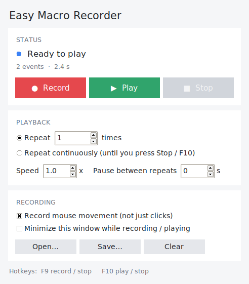

# Easy Macro Recorder

Record your mouse and keyboard, then play it back once, a set number of times, or continuously until you stop it.



## Features

- Records mouse movement, clicks, scrolling and every key press, with the original timing.
- One-click **Record**, **Play** and **Stop**, plus global hotkeys that work while the window is in the background:
  - **F9** start / stop recording
  - **F10** start / stop playback
- **Repeat N times** or **Repeat continuously** until you press Stop / F10.
- Playback **speed** (0.25x to 5x) and an optional **pause between repeats**.
- Save and open macros as `.macro.json` files.
- Keys and mouse buttons are always released when playback stops, so nothing gets stuck down.
- The click on the Stop button itself is left out of the recording.

## Run it (Windows)

1. Install Python 3.9 or newer from python.org (tick "Add Python to PATH").
2. In this folder:

   ```
   pip install -r requirements.txt
   python easy_macro_recorder.py
   ```

## Make an .exe

Double-click `build_exe.bat`, or run:

```
pip install pyinstaller
pyinstaller --onefile --windowed --name EasyMacroRecorder easy_macro_recorder.py
```

The program ends up in `dist\EasyMacroRecorder.exe` and runs without Python installed.

## Tips

- To replay into a program running as administrator, run Easy Macro Recorder as administrator too (Windows blocks input from a lower-privilege app).
- Turn off "Record mouse movement" to record only clicks; playback then jumps straight to each click position.
- Some games ignore simulated input or block it with anti-cheat; check a game's rules before automating it.

## Development

`macro_engine.py` holds recording and playback with no GUI code; `easy_macro_recorder.py` is the tkinter window. Run the tests with:

```
pip install pytest
python -m pytest tests
```

## Building the .exe for Windows 10 / 11

You have two ways to get the executable.

### Option A — let GitHub build it (recommended)

Every push to this branch runs `.github/workflows/build-windows.yml` on a clean
`windows-latest` runner: it runs the tests, builds the .exe, prints its SHA-256,
and uploads it as a build **artifact**. Open the run under the repo's **Actions**
tab and download `EasyMacroRecorder-windows`. When you publish a GitHub
**Release**, the same workflow attaches the .exe to it.

Building on a clean, public runner also helps with antivirus: the binary comes
from a known, reproducible environment rather than your PC, and the published
SHA-256 lets anyone confirm they have exactly that file.

### Option B — build locally

Double-click `build_exe.bat`, or:

```
pip install -r requirements.txt pyinstaller
pyinstaller --clean EasyMacroRecorder.spec
```

The .exe ends up in `dist\EasyMacroRecorder.exe` and runs without Python installed.
The same .exe works on both Windows 10 and Windows 11 (64-bit).

## Why antivirus flags it, and how to stop it

A single-file PyInstaller app that controls the mouse and keyboard is a textbook
false-positive: the PyInstaller bootloader unpacks itself at startup and the app
sends synthetic input, which together look like the *shape* of malware to a
heuristic scanner, even though nothing here is malicious. This project already
does the things that reduce false positives without changing what the program is:

- **Embeds real version metadata** (`version_info.txt`) so the file isn't anonymous.
- **No UPX compression** — packers are one of the strongest heuristic triggers.
- **Builds on a clean CI runner** with a published SHA-256.
- **Trims unused modules**, keeping the binary small and plain.

The only thing that reliably stops *every* mainstream antivirus from flagging an
executable is an authenticode signature from a trusted certificate:

1. **Buy a code-signing certificate** from a CA (Sectigo, DigiCert, etc.).
   A standard OV certificate still needs reputation to build over time; an
   **EV certificate** clears Microsoft SmartScreen almost immediately but costs
   more and ships on a hardware token.
2. **Sign the .exe** with `signtool` (part of the Windows SDK):

   ```
   signtool sign /fd SHA256 /tr http://timestamp.sectigo.com /td SHA256 ^
     /f your-cert.pfx /p <password> dist\EasyMacroRecorder.exe
   ```

   In CI you'd store the certificate as an encrypted secret and run the same
   command after the build step.
3. **If it's still flagged** after signing, submit it to the vendors as a false
   positive — this is a normal, supported process:
   - Microsoft Defender: <https://www.microsoft.com/wdsi/filesubmission>
   - Each other AV vendor has a similar "report a false positive" form.

Without signing, expect occasional SmartScreen "unknown publisher" prompts and
the odd scanner flag; that's inherent to shipping an unsigned input-automation
tool, not a sign that anything is wrong with the build.
